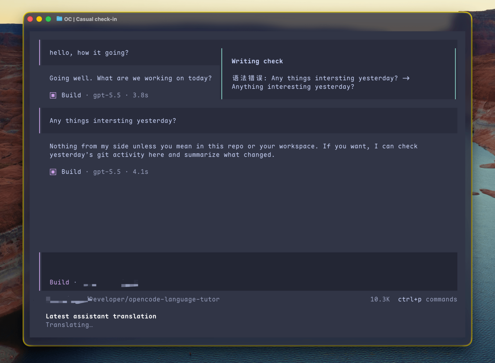

# OpenCode Language Tutor

English | [简体中文](README.md)

> Heavily inspired by [PI Language Tutor](https://github.com/mackt/pi-language-tutor)

This is a language tutor plugin for the
[OpenCode](https://github.com/anomalyco/opencode). It can translate the agent's
responses into your native language, and it can also check your prompts and
give up to three useful corrections. It is intended to make it easier to communicate
with an agent in the language that you are learning.

> [!warning]
> Because OpenCode does not provide the ability to re-render historical transcript
> message, the plugin cannot display translations below each paragraph of the
> original text, nor can it display writing checks and suggestions below user prompts.
> This plugin is still under development!



## Quick Start

### Install from npm

> [!note]
> Not available

### Using Git

```bash
git clone https://github.com/kjasn/opencode-language-tutor.git

cd opencode-language-tutor

opencode
```

Default configuration is set to learn English in simple Chinese.
You can change the settings by `/lang-tu` command.


Automatic writing checks are enabled by default. They start in the background
as soon as an eligible user message is sent, without waiting for the main
assistant response. Automatic translation is disabled by default, so enable
**Auto-translate** in `/lang-tu` when you want translations after every
assistant response.

### Use Local LLM

<details>
<summary>Use Ollama local models for fast, low-cost writing-check and translation tasks.</summary>
<br/>

> [!warning]
> Small models may not perform well for writing checks.

For example, add the following configuration to your OpenCode config file in `~/.config/opencode/opencode.json`:

Click [here](https://docs.ollama.com/integrations/opencode#opencode) for details.

```json
{
  "$schema": "https://opencode.ai/config.json",
  "provider": {
    "ollama": {
      "npm": "@ai-sdk/openai-compatible",
      "name": "Ollama",
      "options": {
        "baseURL": "http://localhost:11434/v1"
      },
      "models": {
        "qwen2.5:7b": {
          "name": "qwen2.5:7b"
        }
      }
    }
  }
}
```

</details>

## Example

Writing-check results are shown by OpenCode's toast notification in the
**upper-right corner**. Translations appear below the prompt; use
`/translations` to browse earlier translations in the current session.

## More Details

The plugin checks eligible prompts for grammar, spelling, and more natural
wording, then shows up to three useful suggestions in an OpenCode toast. It can also
translate completed assistant responses and keep recent translations available
through `/translations`. Configure languages, feature switches, and optional
separate models with `/lang-tu`; otherwise it uses the current session model.

It is a lightweight helper, not a full language teacher: it does not rewrite
whole prompts, grade proficiency, translate user prompts, or execute tools and
commands. Slash commands, short prompts, and prompts containing fenced code are
skipped. _Tutor requests run in short-lived isolated OpenCode sessions, with
tools disabled, so they do not affect the main conversation._

### Internal No-Tools Agent

The plugin uses `.opencode/agents/language-tutor.md` for its isolated grammar
and translation calls. Its `tools: { "*": false }` setting prevents tool
schemas from being sent to translation-only models. It affects only the
plugin's `language-tutor` agent, not your normal Build or Plan agents.

Inspect the resolved configuration from the project root with:

```sh
opencode debug config | rg -n -A12 -B2 '"language-tutor"'
```

## Debugging

The plugin writes diagnostics through OpenCode's logging API instead of
printing into the prompt panel. Find the active log directory with:

```sh
opencode debug paths
```

Follow this plugin's entries in another terminal (the default log path is shown
below):

```sh
tail -f ~/.local/share/opencode/log/opencode.log \
  | rg --line-buffered '{some-key-words}'
```

## TODO List

- [ ] Replace write check suggestions toast notification with a **persistent** display.

- [ ] Make translation display in a interactive way, for example large translation
      result can be displayed in a **scrollable area** and auto fold large code blocks.

- [ ] ...
